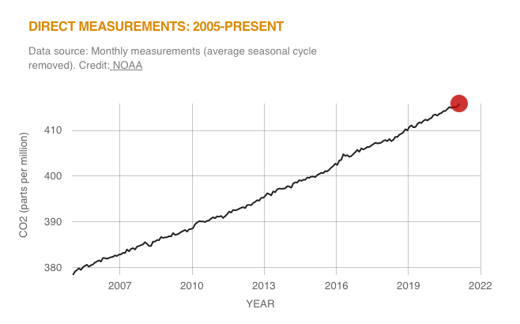
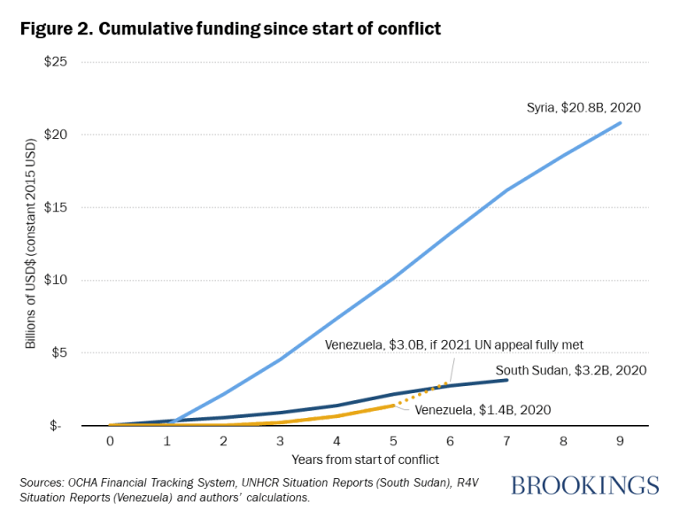
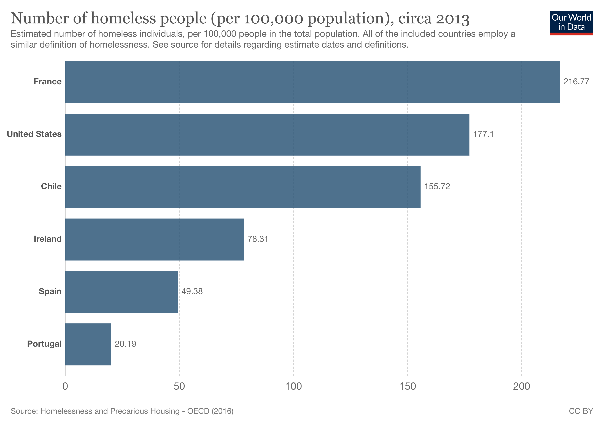

---
title: "Week 6: Examples for Data Visualization"
---


# Please visit the following page on Data Visualization.

# [Alternative Plots](https://www.data-to-viz.com/)


####################################################################
## Visualize the distribution of a continuous variable.
####################################################################

#### What Airbnb really does to a neighbourhood?

# Please read this article:  https://www.bbc.com/news/business-45083954
# Main points are: 
# Millions of people use Airbnb when travelling but its popularity sometimes puts it at odds with locals. 
# So, how do short-term holiday lets really affect a neighbourhood?

# In Manhattan's Lower East Side, for example, one study found that full-time Airbnb listings earned, 
# on average, two to three times the median long-term rent.

# The Los Angeles study indicated that, in 2014, almost half of Airbnb listings were clustered in seven neighbourhoods, 
# where rents increased a third more quickly than the city average. The wider US study suggested a 10% increase in Airbnb 
# listings led to a 0.42% increase in rents and a 0.76% increase in house prices.

# But the report also suggests that Airbnb profits from illegal rentals that "cause rent increases, reduce the housing supply, and exacerbate segregation".

# Aside from affordability concerns, some worry that a rapid expansion of short-term lets can alter an area's atmosphere.
# "This thing is changing the sense of place of the neighbourhood. It's changing the feel of it, with almost a revolving door 
# of strangers," one resident said.
# At other times, there have been complaints about short-term visitors' behaviour, including throwing loud parties or creating parking congestion.

# Many guests hope to save money versus a hotel or to have more "authentic" holiday experiences in less touristy neighbourhoods. 
# My research has found as many as 90% of Airbnb guests have said they were "satisfied" or "very satisfied" with their stays.


### Making histogram with ggplot: geom_hist().

# [Inside Airbnb](http://insideairbnb.com/about.html) is a mission driven activist project with the objective to:
# Provide data that quantifies the impact of short-term rentals on housing and residential communities; 
# and also provides a platform to support advocacy for policies to protect our cities from the impacts of short-term rentals.
# By analyzing publicly available information about a city's Airbnb's listings, Inside Airbnb provides filters and key metrics so you can # see how Airbnb is being used to compete with the residential housing market.

# First, visit http://insideairbnb.com/istanbul/

# Then, import Istanbul Airnb Data published in September 2021 from http://insideairbnb.com/get-the-data.html.
# It considers the nightly price of about 23,019 Airbnb apartments in Istanbul in September 2021.
# Note that it is the "listings.csv" file published for Istanbul on September 30, 2021.
# The data disctionary is also available at
# https://docs.google.com/spreadsheets/d/1iWCNJcSutYqpULSQHlNyGInUvHg2BoUGoNRIGa6Szc4/edit#gid=982310896
# Note that archived data may be subject to pricing.


```{r, warning=FALSE, message=FALSE}
#import data
library(tidyverse)
# download the file into your local computer
download.file("http://data.insideairbnb.com/turkey/marmara/istanbul/2021-09-30/visualisations/listings.csv", "data/istanbul_airnb_sep2021.csv")
```

```{r, warning=FALSE, message=FALSE}
# import data into your R session
airnb_data <- read_csv("data/istanbul_airnb_sep2021.csv")
View(airnb_data)
```

```{r}
str(airnb_data)
```

```{r}
# Check the dimensions
dim(airnb_data)
# Check the column names
colnames(airnb_data)
```

#investigate the range of prices

```{r}
# we can see the mean price/night at http://insideairbnb.com/istanbul/
airnb_data %>% 
    select(price) %>% 
    summary(prince_range=range())
```

#investigate the row which has the highest price

```{r}
airnb_data %>% 
    filter(price == max(price)) 
```

# overall averages by by neighbourhood

```{r}
overall_av <- airnb_data %>%   
                group_by(neighbourhood) %>% 
                summarise(mean_price = mean(price)) 
```


```{r}
View(overall_av)
```

# investigate the average price of "entire home/apt" by neighbourhood

```{r}
entire_home <- airnb_data %>% 
                 filter(room_type == c("Entire home/apt")) %>% 
                 group_by(neighbourhood) %>% 
                 summarise(mean_price_home = mean(price))
```

```{r}
View(entire_home)
```

# investigate the average price of "Private room" by neighbourhood

```{r}
private_room <- airnb_data %>% 
                 filter(room_type == c("Private room")) %>% 
                 group_by(neighbourhood) %>% 
                 summarise(mean_price_room = mean(price))
```

```{r}
View(private_room)
```

# Combine three data sets

```{r}
overall_av %>% 
  left_join(entire_home) %>% 
   left_join(private_room) %>% 
   View()  
```

# listing per host

```{r}
data_by_host <- airnb_data %>% 
                 group_by(host_id) %>% 
                 summarise(n=n()) %>% 
                 arrange(desc(n))
```

```{r}
View(data_by_host)
```

# Single-list per host

```{r}
data_by_host %>% 
  filter(n == 1) %>%  #filter(n>1) multiple-list per host
  summarise(total=sum(n)) %>% 
  View()
```

# investigate the number of reviews by neighbourhood

```{r}
airnb_data %>% 
           group_by(neighbourhood) %>% 
           summarise(total=sum(number_of_reviews)) %>% 
           arrange(desc(total)) %>% 
           View()
```


More example at:
https://www.analyticsvidhya.com/blog/2021/10/end-to-end-predictive-analysis-on-airbnb-listings-data/


# Histogram 
# The most common way to represent a unique numeric variable is with a histogram. 
# Basically, the numeric variable is cut in several bins: between 0 and 10 TLs a night, 
# between 10 and 20 and so on. This is represented on the X axis. 
# Then, the number of apartments per bin is counted and represented on the Y axis.

# Focus on the data where prices are less than 3000TL
# Draw a histogram of prices where binwidth is equal to 100,
# bin center is 50, and fill in the bins with color is #13c3d6 and bin border frame with black color.
# add main title, as well as x and y labels to the plot.

```{r}
library(ggplot2)
airnb_data %>% 
    filter(price < 3000) %>% # we can combine dplyr function with ggplot2 through pipe operator
    ggplot(aes(x = price)) +
       geom_histogram() #bins: Defaults to 30.
```

```{r}
library(ggplot2)
airnb_data %>% 
    filter(price < 3000) %>% 
    ggplot(aes(x = price)) +
      geom_histogram(bins = 50)
```

```{r}
library(ggplot2)
airnb_data %>% 
    filter(price < 3000) %>% 
    ggplot(aes(x = price)) +
       geom_histogram(binwidth = 1000,  # width of the bins
                      center = 500) # center of the bin containing that value
```


```{r}
library(ggplot2)
airnb_data %>% 
    filter(price < 3000) %>% 
    ggplot(aes(x = price)) +
       geom_histogram(binwidth = 100,  # width of the bins
                      center = 50) # center of the bin containing that value
```
 
 
# ggplot2 offers a set of pre-built themes. Try the followings to see which one you like the most:
# theme_bw()
# theme_dark()
# theme_minimal()
# theme_classic()


```{r}
airnb_data %>%
  filter(price < 3000) %>%
  ggplot(aes(x=price)) +
  geom_histogram(binwidth = 100,  
                      center = 50, 
                      fill ="#13c3d6",  #fill: fill the color of bins
                      color= "black") +   #color: colors the bin frame
  scale_x_continuous(breaks = seq(0, 3000, 100)) +
  ggtitle("Night price distribution of Airbnb Istanbul appartments") +
  xlab("Night price") +
  ylab("Number of apartments") +
    #theme(axis.text.x = element_text(angle = 45, hjust=1)): does not work if it is before theme_classic() 
  theme_classic() +  #note them_classic has its own style. 
  theme(plot.title = element_text(face="bold"),
        axis.text.x = element_text(angle = 45, hjust=1)) 
```
 
# The hrbrthemes package provides a nice style. 
# Install the package, load it, and apply the theme_ipsum(). 
 
```{r}
#install.packages("hrbrthemes") # for theme_ipsum
library(hrbrthemes)

airnb_hist <- airnb_data %>%
                filter(price < 3000) %>%
                  ggplot(aes(x=price)) +
                    geom_histogram(binwidth = 100,  
                                   center = 50, 
                                   fill ="#13c3d6",  #fill: fill the color of bins
                                   color= "black") +   #color: colors the bin frame
                    scale_x_continuous(breaks = seq(0, 3000, 500)) +
                    ggtitle("Night price distribution of Airbnb Istanbul appartments") +
                    xlab("Night price") +
                    ylab("Number of apartments") +
                    theme_ipsum() 
```
    
```{r}
airnb_hist
```
    
# histogram is a convenient way to visualize the data: it allows us to understand its distribution.
# the data is right-skewed.

####################################################################
### Making density plots with ggplot: geom_density()
####################################################################

```{r}
library(hrbrthemes)
airnb_dens <- airnb_data %>%
                filter(price < 3000) %>%
                  ggplot(aes(x=price)) +
                     geom_density(fill ="#13c3d6",  #fill: fill the color of bins
                                  color= "black") +   #color: colors the bin frame
                     scale_x_continuous(breaks = seq(0, 3000, 500)) +
                     ggtitle("Night price distribution of Airbnb Istanbul appartments") +
                     xlab("Night price") +
                     ylab("Number of apartments") +
                     theme_ipsum()
```


```{r}
airnb_dens
```


# Show two figures in one plot

```{r}
library(patchwork)
airnb_hist / airnb_dens
```


####################################################################
# Visualize the distribution of a continuous variable by a factor.
####################################################################


### Making boxplot with ggplot: geom_boxplot().


# First, visit https://climate.nasa.gov/vital-signs/carbon-dioxide/ and
# import Carbon Dioxide Data. 
# It considers atmospheric CO2 levels measured at Mauna Loa Observatory, Hawaii, in recent years, 
# with average seasonal cycle removed. 

```{r echo=FALSE, out.height='100%', out.width='90%'}
  
```

```{r}
download.file("ftp://aftp.cmdl.noaa.gov/products/trends/co2/co2_mm_mlo.txt", "data/co2_data.txt")
```

# Have a look the beginning of the text file! Comments are included.
# How to read this text file into R?

```{r}
#import data
library(readr)
co2_data <- read_table("data/co2_data.txt", col_names = FALSE, comment = "#")
View(co2_data)
```


# Keep the X1, X2, X4 variables; rename them as
# year, month, co2_leveland subset the data after the year 2005. 
# change the month into a factor with month lables
# create a season variable based on month.


```{r}
co2 <- co2_data %>% 
        select(X1:X2,X4) %>%
        rename("year" = X1, "month"= X2, "co2_level" = X4) %>% 
        filter(year >= 2005) %>% 
        mutate(month = factor(month, labels = c("Jan", "Feb", "Mar", "Apr", "May", "June", 
                                                "July", "Aug","Sep","Oct", "Nov", "Dec"))) %>% 
        mutate(season = case_when(month %in% c("Dec", "Jan", "Feb")  ~ "Winter",
                                  month %in% c("Mar", "Apr", "May")  ~ "Spring",
                                  month %in% c("June",  "July", "Aug")  ~ "Summer",
                                  TRUE ~ "Fall")) %>% 
       mutate(season = factor(season))
```


```{r}
str(co2)
```


# Compare seasonal averages and medians

```{r}
co2 %>% 
  group_by(season) %>% 
  summarise(co2_mean=mean(co2_level), co2_median=median(co2_level)) %>% 
  View()
```


# Compare monthly medians via Boxplot.
# Boxplot requires that the continuous variable
# is categorized by a categorical variable. 
# So month should be a factor.
# Add main title and subtitle.
# Add xlab and ylab.


```{r}
library(hrbrthemes)

co2 %>% 
  ggplot(aes(x = season, y = co2_level)) +
     geom_boxplot(fill = "green") +
     ggtitle("DIRECT MEASUREMENTS: 2005-PRESENT",
     subtitle="Data source: Monthly measurements. Credit: NOAA") +
     xlab("Month") +
     ylab("CO2 (parts per million)") +
     theme_ipsum() 
```


# Go further
# Increase plot title font size, color
# Decrease subplot title size
# Change axis title size 
# Most importantly, label x axis tick mark labels from 1:12 to Jan:Dec.

```{r}
co2 %>% 
     ggplot(aes(x = season, y = co2_level)) +
      geom_boxplot(fill = "green") +
      ggtitle("DIRECT MEASUREMENTS: 2000-PRESENT",
      subtitle="Data source: Monthly measurements. Credit: NOAA") +
      xlab("Month") +
      ylab("CO2 (parts per million)") +
      theme_ipsum() +
      theme(plot.title = element_text(size=14, color="red"), 
            plot.subtitle = element_text(size=11), 
            axis.title = element_text(size=14,face="bold"),
            axis.text.x=element_text(face="italic"))
```


####################################################################
# Visualize relationship between two continuous variables
####################################################################


### Making scatter plot with ggplot: geom_point().
### Do this example at  home!..

```{r}
library(dplyr)
library(ggplot2)
library(hrbrthemes)

# Create data
d1 <- data.frame(x = seq(1,100), 
                 y = rnorm(100), 
                 name = "No trend")
d2 <- d1 %>% 
      mutate(y = x*10 + rnorm(100, sd = 60)) %>%
      mutate(name = "Linear relationship")

d3 <- d1 %>%
      mutate(y = x^2 + rnorm(100,sd = 140)) %>%
      mutate(name = "Square")

d4 <- data.frame( x = seq(1,10,0.1), 
                  y = sin(seq(1,10,0.1)) + 
                    rnorm(91,sd = 0.6)) %>% 
                    mutate(name = "Sin")

data <- rbind(d1, d2, d3, d4)

head(data)
```

```{r}
# Plot
data %>%
  ggplot(aes(x=x, y=y)) +
    geom_point(color="#69b3a2", alpha=0.8) +
    theme_ipsum() +
    facet_wrap(~name, scale="free")
```

########################################################################
# Visualize relationship between one continuous variables and one factor
########################################################################

# Life expectancy data

```{r}
library(gapminder)
View(gapminder)
```

```{r}
str(gapminder)
```

# Plot the life expectancy by countries
# Get the Europe in 2007 and add
# main title, xlab, and ylab.


```{r}
gapminder %>%
  filter(year == 2007,  continent == "Europe") %>%
  ggplot(aes(lifeExp, country)) +  #country is a factor
    geom_point() +
    ggtitle("Life expectancy in the Europe in 2007") +
    xlab("Life expactancy in years") +
    ylab("Country")
```

# The graph above looks like the one in Biden.png (in image folder on the right)

# Default order is alphabetic, from bottom to top.
# We will see this specifically next week. library forcats.
# Order countries with respect to life expectancy.
# Draw a vertical line at x=80 so that we can see
# which countries have life expectancy years greater than 80.

```{r}
#install.packages("forcats")
library(forcats)

gapminder %>%
  filter(year == 2007, continent == "Europe") %>%
  mutate( country = fct_reorder(country, lifeExp)) %>% #order country by lifeexp
    ggplot(aes(lifeExp, country)) + 
    geom_point() +
    ggtitle("Life expectancy in the Europe in 2007") +
    xlab("Life expactancy in years") +
    ylab("Country") +
    theme_classic() +
    geom_vline(aes(xintercept=80), color = "red") +
    scale_x_continuous(breaks = seq(71,82,1), limits = c(71,82))
```

# Now focus on 4 countries only: Turkey, Greece, Bulgaria, and Romania
# Plot the life expectancies of these countries across the years.

```{r}
gapminder %>%
  filter(country %in% c("Turkey", "Greece", "Bulgaria", "Romania")) %>%
  ggplot(aes(year, lifeExp)) + 
  geom_line() +
  ylab("Life expactancy in years") +
  xlab("Year") +
  facet_wrap(~country, nrow = 2) +
  theme_bw() 
```


# Default ordering is alphabetic; 

```{r}
gapminder %>%
  filter(country %in% c("Turkey", "Greece", "Bulgaria", "Romania")) %>%
  mutate(country = fct_reorder(country, lifeExp, mean)) %>% # default: order by median, change it to min, max, median.
  ggplot(aes(year, lifeExp)) + 
  geom_line() +
  facet_wrap(vars(country), nrow = 2) +
  ylab("Life expactancy in years") +
  xlab("Year") +
  theme_bw() +
  theme(strip.text = element_text(size = 12, color = "black", face = "bold.italic"), 
        strip.background = element_rect(color="black", fill="#FC4E07", size=1.5, linetype="solid"))       
```


# More: https://www.datanovia.com/en/blog/how-to-change-ggplot-facet-labels/

########################################################################
# Multiple line plots on the same figure.
########################################################################

# Focus on the Venezuelan refugess data at
# https://www.brookings.edu/blog/up-front/2021/02/26/venezuelan-refugees-and-their-receiving-communities-need-funding-not-sympathy/

##Figure 1:
##Yet, despite the remarkable similarity in terms of both magnitude and evolution between these two groups of refugees (Syrians ##and Venezuelans), there continues to be a massive gap when it comes to funding from the international community to assist the ##receiving countries.


```{r echo=FALSE, out.height='100%', out.width='90%'}
  
```

# Actually, we do not have data here. But, I will simulate a similar one.

```{r}
refugee_data <- data.frame("Syria"= c(0.1,0.5,2.5,4.9,7.5,10.2,14,16.5,18,22),
                            "South Sudan"= c(0.4+rnorm(8,2,0.5), NA, NA),
                            "Venezuala"= c(0.1+rnorm(6,0.8,0.4), NA, NA, NA, NA),
                             "x"= seq(0, 9, 1))
refugee_data
```

# Let's see the plot first

```{r}
refugee_data %>% 
  ggplot(aes(x=x)) +
  geom_line(aes(y=Syria), color="cornflowerblue") +  #line 1
  geom_line(aes(y=Venezuala), color="#ffc100") +     #line 2
  geom_line(aes(y=South.Sudan), color="#00008b") +   #line 3
  xlab("Years from start of conflict") +
  ylab("Billions of USD$ (constant 2015 USD") +
  ggtitle("Cumulative funding since start of conlifct") 
```

# improve it

```{r}
refugee_data %>% 
  ggplot(aes(x=x)) +
  geom_line(aes(y=Syria), color="cornflowerblue") +
  geom_line(aes(y=Venezuala), color="#ffc100") +
  geom_line(aes(y=South.Sudan), color="#00008b") +
  xlab("Years from start of conflict") +
  ylab("Billions of USD$ (constant 2015 USD") +
  ggtitle("Cumulative funding since start of conlifct") +
  scale_y_continuous(label = scales::dollar,   #add dollar symbols
                     limits = c(0, 25)) +
  scale_x_continuous(breaks = seq(0, 9, 1), #adjust tick marks
                     limits = c(0, 9), 
                     expand = c(0.0, 0.5)) +
  theme_minimal() +  #simple background
  theme(panel.grid = element_line(linetype = "dashed", size = 0.4),  # add dashed lines
        panel.grid.major.x = element_blank(),  #remove major vertical lines
        panel.grid.minor = element_blank(),   #remove minor lines
        plot.title=element_text(face="bold")) +
  geom_text(aes(x=8, y=22),  label="Syria, $20.8B, 2020", size=3) +  # add text, give locations, title, adjust size of the text
  geom_text(aes(x=5.5, y=6), label="Venezuela, $3.B, if 2021 UN appeal fully met", size=3) +
  geom_text(aes(x=8, y=4),  label="South Sudan, $3.2B, 2020", size=3) 
```

## Scatterplot Fit Lines
## Do at home!..

```{r}
library(carData)
library(ggplot2)                                     # for visualization
library(scales)                                      # automatically determining breaks/labels 
data(Salaries, package="carData")
# enhanced scatter plot
ggplot(Salaries, 
       aes(x = yrs.since.phd, 
           y = salary)) +
  geom_point(color="cornflowerblue", 
             size = 2, 
             alpha=.8) +
  scale_y_continuous(label = scales::dollar, 
                     limits = c(50000, 250000)) +
  scale_x_continuous(breaks = seq(0, 60, 10), 
                     limits = c(0, 60)) +
  theme_minimal() +                                  # use a minimal theme
  labs(x = "Years Since PhD",
       y = "",
       title = "Experience vs. Salary",
       subtitle = "9-month salary for 2008-2009")
```


```{r}
library(ggplot2)                                     # for visualization
ggplot(Salaries,
       aes(x = yrs.since.phd, 
           y = salary)) +
  geom_point(color= "cornflowerblue") +
  geom_smooth(method = "lm", color = "brown1")+
  theme_minimal() +                                  # use a minimal theme
  labs(x = "Years Since PhD",
       y = "",
       title = "Experience vs. Salary",
       subtitle = "9-month salary for 2008-2009")
```


```{r}
library(ggplot2)                                     # for visualization
ggplot(Salaries, 
       aes(x = yrs.since.phd, 
           y = salary)) +
  geom_point(color= "cornflowerblue") +
  geom_smooth(method = "lm", 
              formula = y ~ poly(x, 2), 
              color = "yellow")+
  theme_minimal() +                                  # use a minimal theme
  labs(x = "Years Since PhD",
       y = "",
       title = "Experience vs. Salary",
       subtitle = "9-month salary for 2008-2009")
```

########################################################################
## Bar Charts
########################################################################

# Bar charts are useful for displaying
# frequencies of categorical variables. 


#The OECD Affordable Housing Database presents a collection of available statistics on homelessness in member countries, in line #with definitions used in the corresponding national surveys. Estimates, in most cases, correspond to point-in-time estimates.
# In the visualization we provide an overview of cross-country estimates that are comparable in the sense that they all include #exclusively people in the following categories: (i) people living in the streets or public spaces without a shelter that can be #defined as living quarters; (ii) people in emergency accommodation with no place of usual residence, who move frequently #between various types of accommodation; and (iii) people living in accommodation for the homeless, including homeless hostels, #temporary accommodation and other types of shelters for the homeless.
# Let's focus on "Homeless data" at 
# https://ourworldindata.org/homelessness#:~:text=Homelessness%20remains%20an%20important%20policy,in%201%2C670%20Americans%20is%20homeless.
# We have number of homeless people for several countries in 2013.


```{r echo=FALSE, out.height='100%', out.width='90%'}
  
```

```{r}
homeless_data <- readr::read_csv("data/number-of-homeless-people-per-100000-population-circa-2013.csv", 
                            skip=1, col_names = c("Country", "Code", "Homeless_Total"))
View(homeless_data)
```

```{r}
str(homeless_data)
```


```{r}
homeless_data %>%
  mutate(Country = factor(Country, labels = c("Chile","France","Ireland","Portugal","Spain","United States"))) %>% 
  ggplot(aes(x=Country, y=Homeless_Total)) + 
  geom_bar(stat = "identity", fill="#1c4966") +
  labs(title = "Number of homeless people (per 100,000 population), circa 2013", 
       subtitle = "Estimated number of homeless individuals, per 100,000 people in the total population. All of the included\ncountries employ a similar definition of homelessness. See source for details regarding estimate dates and
definitions.", 
       caption="Source:Homeless and Precarious Housing-OECD (2016)",
       x = "",
       y = "")
```

# improve it

```{r}
homeless_data %>%
  mutate(Country = factor(Country, labels = c("Chile","France","Ireland","Portugal","Spain","United States"))) %>% 
  ggplot(aes(x=Country, y=Homeless_Total)) + 
  geom_bar(stat = "identity", fill="#1c4966") +
  labs(title = "Number of homeless people (per 100,000 population), circa 2013", 
       subtitle = "Estimated number of homeless individuals, per 100,000 people in the total population. All of the included\ncountries employ a similar definition of homelessness. See source for details regarding estimate dates and
definitions.", 
       caption="Source:Homeless and Precarious Housing-OECD (2016)",
       x = "",
       y = "") +
  theme_minimal() +
  theme(panel.grid.minor = element_line(linetype = "dashed", size = 0.7), #all grid lines are dashed
        panel.grid.major= element_blank(),  #remove major ones
        plot.title = element_text(size = 14), 
        plot.subtitle =  element_text(size = 9),
        plot.caption =  element_text(hjust = -.25), 
        axis.text.y = element_text(hjust = 1.0)) +
  coord_flip() +  #flip the bars, align them horizontally
  geom_text(aes(label=round(Homeless_Total,2)), hjust= -0.2) #add frequency counts

```


Not in the same order! Order levels by magnitude! Then do it one more time!..


### More graphics!..

https://www.ft.com/graphics


### Note to myself: Area graph (https://twitter.com/ftdata/status/1361983243797622793/photo/2) and side-by-side bar graphs (https://twitter.com/ftdata/status/1371446663152336897/photo/1).
### stacked bar graph (comes next week).


# Sources I used.

https://bookdown.org/BaktiSiregar/data-science-for-beginners/Advanced-Visualizations.html
https://socviz.co/groupfacettx.html
https://www.worldbank.org/en/data/datatopics/gender/data-resources
https://www.fao.org/faostat/en/#country/223
https://saraemoore.github.io/Rdataviz2017/#23
https://github.com/thereseanders/workshop-dataviz-fsu
https://saraemoore.github.io/Rdataviz2017/#2
https://bbc.github.io/rcookbook/
https://4va.github.io/biodatasci/r-viz-gapminder.html
https://bookdown.org/BaktiSiregar/data-science-for-beginners/intro.html#what-is-data-science
https://bookdown.org/BaktiSiregar/data-science-for-beginners/Visualization.html#univariate-data
https://www.brookings.edu/blog/up-front/2021/02/26/venezuelan-refugees-and-their-receiving-communities-need-funding-not-sympathy/
http://www.fao.org/faostat/en/#country/223
https://mdsr-book.github.io/mdsr2e/ch-vizI.html#datavizI-exercises

---
# Attributiones

- This lecture note is mainly developed by following sources:
   - [Berlin](https://github.com/Z3tt/Z3tt/blob/master/content/post/2019-08-05_ggplot2-tutorial.Rmd).
   - [Paul](https://bookdown.org/paul/applied-data-visualization).
   - [Coding Club](https://ourcodingclub.github.io/tutorials/datavis/).

