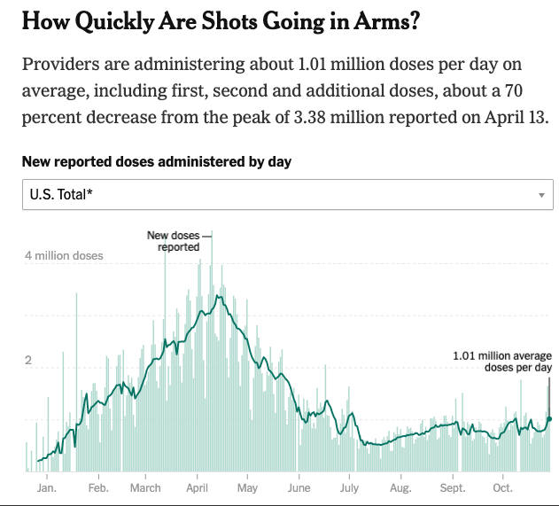
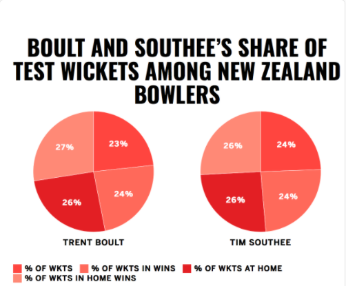

```{r xaringan-themer, include=FALSE, warning=FALSE}
library(xaringanthemer)
style_mono_light(
  base_color = "#042856", 
  header_color = "#7cacd4",
  title_slide_text_color = "#7cacd4",
  link_color = "#0000FF",
  text_color = "#000000",
  background_color = "#FFFFFF",
  header_h1_font_size ="2.00rem"
  )
```

```{r xaringan-scribble, echo=FALSE}
xaringanExtra::use_scribble() #activate for the pencil
xaringanExtra::use_xaringan_extra(c("tile_view", "animate_css", "tachyons"))
xaringanExtra::use_panelset()
```


class: left

# Outline

* Introduction to Data Visualization
* Introduction to ggplot2 
* ggplot2 continu'ed (next week)
  * 01-ggplot2.Rmd   (next week)
  
---
class: center, middle

         **What is going on this graph?**

```{r echo=FALSE, out.height='50%', out.width='70%', fig.cap=''}
  
```

[Source](https://acikerisim.tbmm.gov.tr/handle/11543/553)

<!-- First code block is setting options for theme of the slides  -->  
<!-- Second code block is setting global options R code blocks -->  

---
# March 13, 2020...

```{css echo=FALSE}
.pull-left {
  float: left;
  width: 50%;
}
.pull-right {
  float: right;
  width: 50%;
}
```

.pull-left[
```{r echo=FALSE, out.height='100%', out.width='100%'}
knitr::include_graphics('images/guardian1.png')  
```
]

.pull-right[
```{r echo=FALSE, out.height='100%', out.width='90%'}
  
```
]


[Source](https://www.theguardian.com/world/2020/mar/13/coronavirus-pandemic-visualising-the-global-crisis)


---

```{css echo=FALSE}
.pull-left {
  float: left;
  width: 50%;
}
.pull-right {
  float: right;
  width: 50%;
}
```

# October 29, 2021...

.pull-left[
```{r echo=FALSE, out.height='100%', out.width='100%'}
  
```
]

.pull-right[
<br>
<br>
```{r echo=FALSE, out.height='100%', out.width='100%'}
  
```
]

[Source](https://www.nytimes.com/interactive/2020/us/covid-19-vaccine-doses.html#new-doses)
---
class: middle, center

```{r echo=FALSE, out.height='50%', out.width='75%'}
  
```

[Source](https://www.nytimes.com/interactive/2020/us/covid-19-vaccine-doses.html#new-doses)
---
class: middle, center
```{r echo=FALSE, out.height='100%', out.width='85%'}
  
```

[Source](https://www.nytimes.com/interactive/2020/us/covid-19-vaccine-doses.html#new-doses)
---
- According to an article on [Medium](https://medium.com/nightingale/for-public-health-organizations-data-visualization-is-not-a-choice-e945f54152b8):
  - "Accurate, high-quality data visualization is, in many cases, the most responsible and effective way to share information and educate people".
  
---
.pull-left[
```{r echo=FALSE, out.height='100%', out.width='100%'}
  
```
 [Dr. Ömer Durmaz Veri Görselleştirme Sergisi](https://www.arch.columbia.edu/exhibitions/61-speak-to-the-eyes)
 
_Bilginin grafiklerle işleniş serüvenini çarpıcı örneklerle aktaran “Gözlere Konuşmak: Osmanlı’dan Cumhuriyet’e Bilginin Görselleştirilmesi” başlığıyla sunulan Stüdyo X Istanbul’da yer alan sergi **veri görselleştirmeyi grafik tasarım ile çerçevelendirerek inceliyor**._

]

.pull-right[
- [Kürator Ömer Durmaz'a](https://yazname.com/bilgi-gorsellestirmenin-tarihteki-yolculugu/24/06/2017)  göre:
  - "Propaganda amaçlı da kullanılan istatistik grafikleri, toplumu yönlendirmede bir iletişim aracına dönüşüyor." 
  - "Hem sokak sergilerinde, hem de fuarlarda halka anlatılacak konular için infografikler ve istatistik grafikleri kullanılırmış."
  - "Halkın okuma yazma bilmediği bir toplumda halkı yönlendirmek için görsel olarak konuşmak gerekiyor."

]
---

```{css echo=FALSE}
.pull-left {
  float: left;
  width: 50%;
}
.pull-right {
  float: right;
  width: 50%;
}
```

.pull-left[
```{r echo=FALSE, out.height='100%', out.width='100%'}
  
```

[Source](https://qz.com/1781388/criteria-for-good-data-visualization-according-to-design-and-statistics/)

]

.pull-right[
- The field of data visualization has become a tussle between **accuracy** and **beauty**.
- In one corner, **designers** say that data is fungible as long as the presentation is **eye-catching**. 
- In the other corner, **statisticians** argue that **clarity** should rarely be sacrificed in the name of novelty or entertainment.
]

---

```{css echo=FALSE}
.pull-left {
  float: left;
  width: 50%;
  height: 100;
}
.pull-right {
  float: right;
  width: 50%;
}
```

.pull-left[
```{r echo=FALSE, out.height='100%', out.width='100%'}
  
```

- According the seminal paper "How to Display Data Badly" by Howard Wainer:
  - The aim of good data graphics is to display data accurately and clearly.
]

.pull-right[
- For accurate transmission of information, there should be reasonable amount of data density (data plots, values etc) on the plot. Less information results in a bad graph.
  
```{r echo=FALSE, out.height='100%', out.width='100%'}
  
```
]

---
- Do not put overwhelming information.

```{r echo=FALSE, out.height='100%', out.width='80%'}
  
```
---
- Do not hide data in the scales if you are talking about change of a variable over time.

```{r echo=FALSE, out.height='100%', out.width='70%'}
  
```

---
```{css echo=FALSE}
.pull-left {
  float: left;
  width: 50%;
  height: 100;
}
.pull-right {
  float: right;
  width: 50%;
}
```

- Do not manipulate y-axis.

.pull-left[
```{r echo=FALSE, out.height='100%', out.width='90%', fig.cap="Bad example"}
  
```
]

.pull-right[
```{r echo=FALSE, out.height='100%', out.width='100%', fig.cap="Good example"}
  
```
]
---

```{css echo=FALSE}
.pull-left {
  float: left;
  width: 50%;
  height: 100;
}
.pull-right {
  float: right;
  width: 50%;
}
```

- Do not change scales in mid-axis. This could be confusing since the axis scales have not been kept standard.

.pull-left[
```{r echo=FALSE, out.height='100%', out.width='100%'}
  
```

]

.pull-right[
```{r echo=FALSE, out.height='100%', out.width='100%'}
  
```

]


---
- Do match the magnitude of metaphorical representation with the numbers.

```{r echo=FALSE, out.height='100%', out.width='50%'}
  
```

---
- Do not feature the wrong graph.

```{r echo=FALSE, out.height='100%', out.width='60%'}
  
```

---
```{css echo=FALSE}
.pull-left {
  float: left;
  width: 50%;
  height: 100;
}
.pull-right {
  float: right;
  width: 50%;
}
```

- Use appropriate color scheme.

.pull-left[
```{r echo=FALSE, out.height='100%', out.width='90%'}
  
```
]

.pull-right[
```{r echo=FALSE, out.height='100%', out.width='100%'}
  
```
]

---
- More is available on:
  - [Data Visualization History](https://time.com/5883299/data-visualization-history/?utm_source=twitter&utm_medium=social&utm_campaign=editorial&utm_term=history_health&linkId=98174810).
  - [New York Times & American Statistical Association ](https://www.nytimes.com/2020/06/10/learning/over-60-new-york-times-graphs-for-students-to-analyze.html) collaboration on "What is going on this graph?".
      - [Look at this!](https://www.nytimes.com/2018/01/04/learning/whats-going-on-in-this-graph-jan-9-2018.html)

