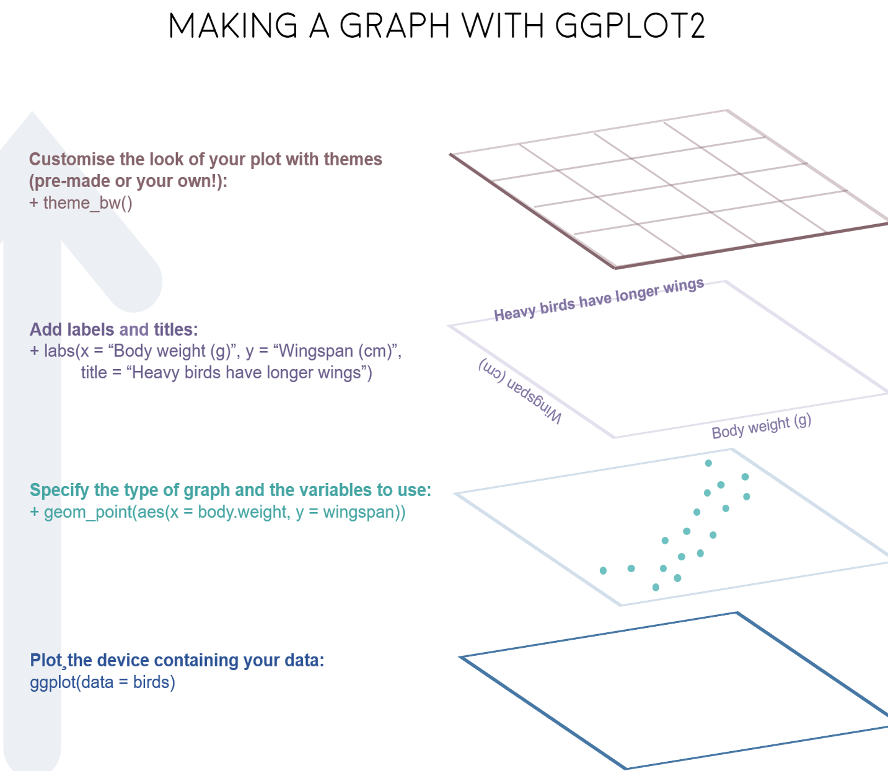
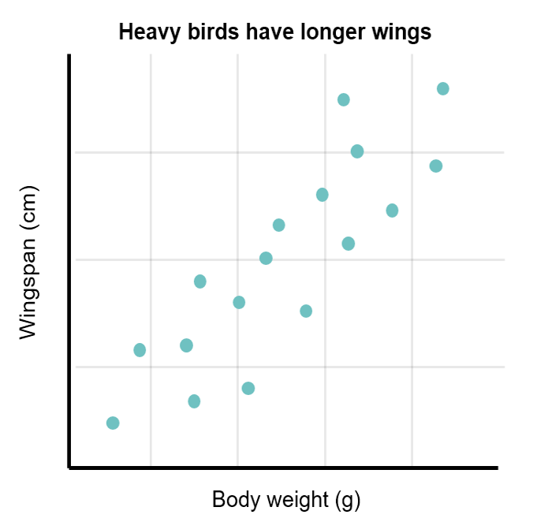
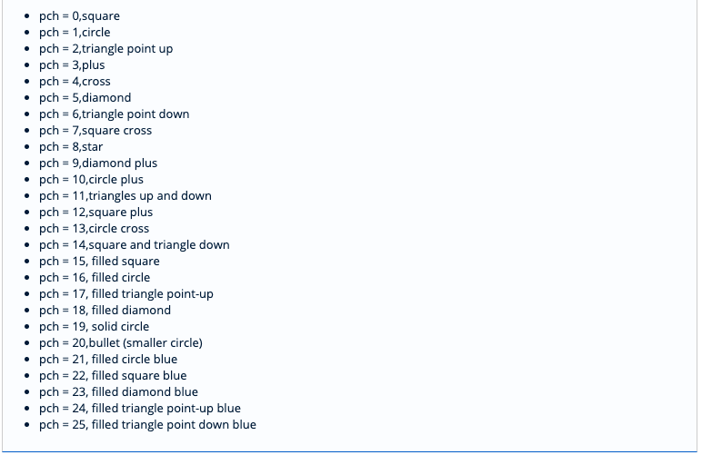
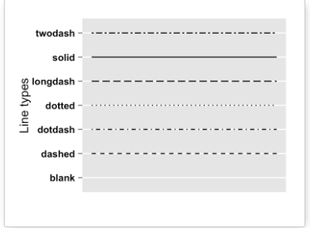
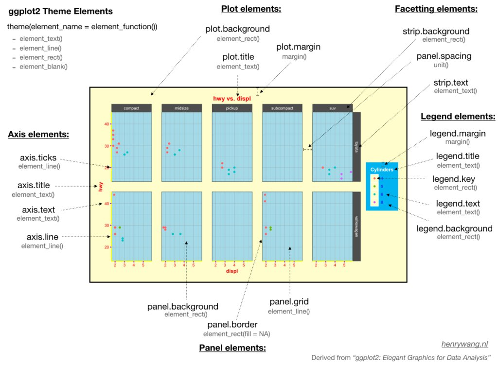
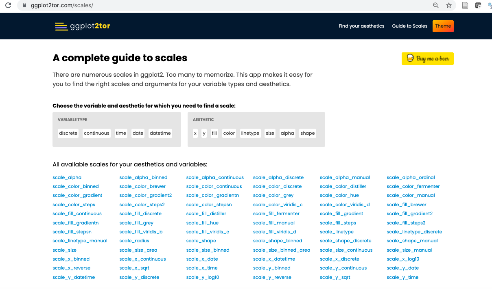

```{r xaringan-themer, include=FALSE, warning=FALSE}
library(xaringanthemer)
style_mono_light(
  base_color = "#042856", #itu navy blue
  header_color = "#7cacd4", #itu baby blue
  title_slide_text_color = "#7cacd4",
  link_color = "#0000FF",
  text_color = "#000000",
  background_color = "#FFFFFF",
  header_h1_font_size ="2.00rem"
  )
```

```{r xaringan-scribble, echo=FALSE}
xaringanExtra::use_scribble() #activate for the pencil
xaringanExtra::use_xaringan_extra(c("tile_view", "animate_css", "tachyons"))
```


```{r, echo=FALSE, purl=FALSE, message = FALSE}
knitr::opts_chunk$set(comment = "#>", purl = FALSE, fig.showtext = TRUE, out.width="40%", retina = 2)
```


# Data

- We will be using data from the *National Morbidity and Mortality Air Pollution Study* (NMMAPS) which is available in [Statistical Methods in Environmental Epidemiology with R](http://www.springer.com/de/book/9780387781662).
- The data can be viewed in [here](https://github.com/z3tt/R-Tutorials/blob/master/ggplot2/chicago-nmmaps.csv).
- <p> **Data Description:**
The data set contains daily mortality (all causes, CVD, respiratory), weather (temperature, dew point temperature) and pollution data (PM10 and ozone) for Chicago in the period 1987-2000 from NMMAPS. <p>
- Here are the variables in this data set:

```{r, eval=F}
`date`: Date in the period 1987-2000.
`death`: Counts of all cause mortality excluding accident.
`temp`: Mean temperature (in Celsius degrees).
`dewpoint`: Dew point temperature.
`pm10`: PM10 (More info https://cevreselgostergeler.csb.gov.tr/hava-kalitesinde-pm10-ve-so2-ortalamalari-i-85734)
`o3`: Ozone.
`time`: The sequence of observations.
`season`: season.
`year`: Year.
```

---
- We can import the data into our `R` session:
```{r, warning=F, message=F}
# full address: https://github.com/Z3tt/R-Tutorials/blob/master/ggplot2/chicago-nmmaps.csv
chicago <- readr::read_csv("https://raw.githubusercontent.com/Z3tt/R-Tutorials/master/ggplot2/chicago-nmmaps.csv")
```

```{r, eval=F}
#run it on your machine
#check the structure of the data
str(chicago)
```


```{r, eval=F}
#run it on your machine
#view it on the data viewer panel
View(chicago)
```

---
class: center, middle

# Introduction to ggplot2

  

---
# ggplot2 package 

- The [ggplot2](https://ggplot2.tidyverse.org/) is a plotting package in `tidyverse` ecosystem for creating statistical graphics based on the language of the [Grammar of Graphics](https://www.amazon.com/Grammar-Graphics-Statistics-Computing/dp/0387245448/ref=as_li_ss_tl?ie=UTF8&qid=1477928463&sr=8-1&keywords=the+grammar+of+graphics&linkCode=sl1&tag=ggplot2-20&linkId=f0130e557161b83fbe97ba0e9175c431) (hence the `gg` in `ggplot2` stands for grammar of graphics).
- It provides a more programmatic interface for
specifying what variables to plot and how they are displayed. 
- In `ggplot2` writing a code for a graph is like **constructing a sentence made up of different parts that logically follow from one another**. 
- In a more visual way, it means **adding layers** that take care of different elements of the plot. 

---
- The plotting workflow will therefore be something like **creating an empty plot**, **adding a layer with your data points**, then adding the axis labels and title, and so on.

--

```{css echo=FALSE}
.pull-left {
  float: left;
  width: 40%;
}
.pull-right {
  float: right;
  width: 60%;
}
```

.pull-left[
```{r echo=FALSE, out.width='80%', fig.cap=''}
  
```
]

--
.pull-right[
```{r echo=FALSE, out.width='120%', fig.cap=''}
  
```
]

---
#### A default ggplot 

- First, to be able to use the functionality of `ggplot2` we have to load the package:

```{r}
#library(tidyverse) or
library(ggplot2)
```

---
- A `ggplot` is built up from the following basic elements:
  1.	**Data**: The raw data that you want to plot.
  2.	**Aesthetics** `aes()`: Aesthetics describe every aspect of a given graphical element such as position, color, shape, size, and transparency.
      - A **very important component** of every graphical element is **its position**, which describes where the element is located. In standard 2D graphics, we describe **positions by an x and y value**.
  3.	**Geometries** `geom_*()`: The geometric shapes that will represent the data such as points, lines. We can manipulate visual aesthetics here as well.
  4.	**Visual themes** `theme()`: The overall visual defaults of a plot, such as background, grids, axes, default typeface, sizes and colors. Control finer points of display (e.g., font, background color etc.).
  5.	**Scales** `scale_*()`: Maps between the data and the aesthetic dimensions, such as data range to plot width or factor values to colors. For an interactive facility visit https://ggplot2tor.com/scales/.
  6.	**Coordinate system** `coord_()`: The transformation used for mapping data coordinates into the plane of the data rectangle. 
  7.	**Facets** `facet_*()`: The arrangement of the data into a grid of plots. 
  8.	**Statistical transformations** `stat_()`: Statistical summaries of the data, such as quantiles, fitted curves, and sums.

---

- In a default `ggplot2`, the first three elements: **data**, **aesthetics**, and  a **geometry** should be specified with the following template:

```{r, eval=F}
ggplot(data = data_name, mapping = aes(x = var1, y = var2)) +  
  geom_*()
```

- We always start to define a plotting object by calling `ggplot(data = data_name)` which just tells `ggplot2` that we are going to work with that data.
- We might want to plot two variables—one on the x and one on the y axis, these are called *positional aesthetics*. Thus we need to add `aes(x = var1, y = var2)` to the `ggplot()` call (the `aes()` stands for aesthetics).  
- Lastly, we should tell `ggplot()` how we want to see the relationship in our data. Thus we need to add a `geom_*()` layer to tell `ggplot()` what geometric object we want to use to identify relationships.
-  Lastly, layer on `geom_*()` as needed, by adding them one at a time.

<br>

- The `ggplot2` allows you to store the current **plot object** in a variable of your choice by assigning it to a variable, in our case called `p`. 

```{r, eval=F}
p <- ggplot(data = data_name, aes(x = var1, y = var2)) + 
      geom_*()
```

-  We can extend this **plot object** later by adding other layers, either all at once or by assigning it to the same or another variable.

---
- In **chicago** data set, let's map the variable `date` to the **x position** and the variable `temp` to the **y position**.

```{r}
#ggplot2 supports unquoted variable names
g <- ggplot(chicago, aes(x = date, y = temp)) 
g
```

<!-- Comment -->   

---
#### Geometries
- When running this, only a panel is created because `ggplot2` does not know *how* we want to plot that data. **So we need to provide a geometry!**

- There are many different geometries (called *geoms* because each function usually starts with `geom_*()`) we can add to a ggplot.
   - For **default geoms**, please visit [ggplot2 reference](https://ggplot2.tidyverse.org/reference/). 
   - For more **geoms provided by extension packages**, please visit [here](https://exts.ggplot2.tidyverse.org/) for a collection of extension packages. 
  
---
- Let's create a **scatter plot**. Then we should add [geom_point()](https://ggplot2.tidyverse.org/reference/geom_point.html) to `ggplot2`:

```{r}
g + geom_point()
```

---
- This data could be also visualized as a **line plot**. So we simply add [geom_line()](https://ggplot2.tidyverse.org/reference/geom_path.html) layer instead:

```{r }
g + geom_line()
```

---
- We can also combine several geometric layers together.

```{r}
g + 
  geom_line() + 
  geom_point()
```

---
#### Change Properties of Geometries

- Within the `geom_*()` command, we can manipulate **visual aesthetics** such as the **color**, **shape**, and **size** of our points.
- Key input arguments include:

|Argument        |Description                                   
|----------------|----------------------------------------------
| `color`        |color **name** or **code** for points (both quoted).
| `shape`        |numeric values or names as **pch** (**p**lot **ch**aracter) for setting plotting point shapes (both quoted).
| `size`         |numeric values **cex** for changing points size.|


---
#### Change colors
- We can use several colors available here:
  - [Full color list](http://www.stat.columbia.edu/~tzheng/files/Rcolor.pdf) or 
  - [Hex color codes](https://htmlcolorcodes.com/), use them both in **quotes**. 
- More info on Hex colors is available here: https://www.w3schools.com/colors/colors_hexadecimal.asp.

---
- Let's color all points in **fire-red** color.

```{r out.width = "35%"}
g + geom_point(color="firebrick")
```

---
- Let's color the points with Hex color code 51DD33.

```{r out.width = "35%"}
g + geom_point(color = "51DD33")
```

---
#### Point shapes

```{css echo=FALSE}
.pull-left {
  float: left;
  width: 50%;

}
.pull-right {
  float: right;
  width: 50%;
}
```

- We can use several **point shapes** listed [here](https://www.datanovia.com/en/blog/ggplot-point-shapes-best-tips/) to change point shape type.

.pull-left[
```{r echo=FALSE, out.height='100%', out.width='70%'}
knitr::include_graphics('images/plot_symbols1.png')  
```
]

.pull-right[
```{r echo=FALSE, out.height='100%', out.width='100%'}
  
```
]

---
- Let's turn all points to **large fire-red diamonds!**

```{r out.width="35%"}
g + geom_point(color = "firebrick", shape = "diamond", size = 1.2)
```


<!-- **`{ggplot2}` understands both `color` and `colour` as well as the short version `col`.**-->   


---
- Use a different color name from [Full list](http://www.stat.columbia.edu/~tzheng/files/Rcolor.pdf) and point shape:

```{r}
g + geom_point(color = "salmon", shape = "plus", size = 2)
```

---
- Use a different color code from [Hex color codes](https://htmlcolorcodes.com/) and point shape:

```{r}
g + geom_point(color = "#042856", shape = "square", size = 2)
```

---
- Note that each `geom_*()` comes with its own properties (called *arguments*) and depending on the `geom_*()` you are using, you may need different arguments.

```{r}
g + geom_line(color = "red", size = 0.3, linetype = "dashed")
```
---

- Use a different line type from this list.

```{r echo=FALSE, out.height='100%', out.width='60%'}
  
```

---
class: center, middle

# Axis Elements
---
class: center, middle

# An Overview of a Plot

```{r echo=FALSE, out.width='70%', fig.cap=''}
 
```

---

#### Axis Titles

- We can add **each axis a title** with `xlab()` and `ylab()` layers, respectively, through providing a **character string** for each label.


```{r out.width = "35%"}
ggplot(chicago, aes(x = date, y = temp)) +
  geom_point(color = "firebrick") +
  xlab("Year") + #<<
  ylab("Temperature (°F)") #<<
```
---
- We can also **add labels** to the axes with `labs()` layers through providing a **character string** for each label we want to change (here `x` and `y`) ([Labs reference](https://ggplot2.tidyverse.org/reference/labs.html)):

```{r out.width = "30%"}
ggplot(chicago, aes(x = date, y = temp)) +
  geom_point(color = "firebrick") +
  labs(x = "Year", y = "Temperature(°F)")#<<
```
---

class: center, middle

# An Overview of a Plot

```{r echo=FALSE, out.width='70%', fig.cap=''}
 
```

---
#### Aesthetics of Axis Elements
- The `theme()` layer function is an essential command to enable us to modify particular theme elements such as **axis titles**, **axis texts**, **axis ticks**, and **axis lines** through:
   - `axis.title`, `axis.title.x`, `axis.title.y`: labels of axes (`element_text()`),
   - `axis.text`, `axis.text.x`, `axis.text.y`: tick labels along axes (`element_text()`),
   - `axis.ticks`, `axis.ticks.x`, `axis.ticks.y`: tick marks along axes (`element_line()`), and
   - `axis.line`, `axis.line.x`, `axis.line.y`: lines along axes (`element_line()`).
-  Please visit [theme elements](https://ggplot2.tidyverse.org/reference/theme.html) for a full list.
-  In conjunction with the theme system, the `element_*()` functions ([reference](https://ggplot2.tidyverse.org/reference/element.html)) **change** the display of how non-data components of the plot are drawn through:
   - `element_text()`: text,
   - `element_line()`: lines,
   - `element_rect()`: borders and backgrounds, and
   - `element_blank()`: draws nothing and assigns no space.

---
- Here is the summary of `theme()` function:

|Axis element  |Subordinated Axis Element     |Description     | Function         | Description | Aesthetics               |
|--------------|------------------------------|----------------|------------------|-------------|--------------------------|
| `axis.title` |`axis.title.x`, `axis.title.y`| labels of axes | `element_text()` |text         |`size`, `color`, `face`, `angle`, `hjust`, `vjust`|
| `axis.text`  |`axis.text.x`, `axis.text.y`  | tick labels along axes |`element_text()`|text   |`size`, `color`, `face`, `angle`, `hjust`, `vjust`|
| `axis.ticks` |`axis.ticks.x`, `axis.ticks.y`| tick marks along axes | `element_line()` |line       | `color`,  `size`,  `linetype`|
| `axis.line`  |`axis.line.x`, `axis.line.y`  | lines along axes | `element_line()`     |line        | `color`, `size`,  `linetype`|  
      

---
#### Change Aesthetics of Axis Titles
 - We can use the `theme()` layer function to modify the axis element `axis.title` and/or the subordinated axis elements `axis.title.x` and `axis.title.y` with `element_text()`function. 
 - Within `element_text()`function we can overwrite the defaults for `size`, `color`, and `face`.
 - Specifically, the `face` argument can be used to make the font `bold` or `italic` or even `bold.italic` (quoted).     
     
---

```{r out.width="30%"}
ggplot(chicago, aes(x = date, y = temp)) +
  geom_point(color = "firebrick") +
  labs(x = "Year", y = "Temperature (°F)") +
  theme(axis.title = element_text(size = 20, color = "blue", face = "italic")) #<<
                                
```

  
---
- We could use a combination of `axis.title.x` and `axis.title.y`. 

```{r out.width="30%"}
ggplot(chicago, aes(x = date, y = temp)) +
  geom_point(color = "firebrick") +
  labs(x = "Year", y = "Temperature (°F)") +
  theme(axis.title.x = element_text(size = 15, color = "sienna"),   #<<
        axis.title.y = element_text(size = 20, color = "orangered")) #<<
```
---
- We could also use a combination of `axis.title` and `axis.title.y`, since `axis.title.x` inherits the values from `axis.title`. 

```{r out.width="40%"}
ggplot(chicago, aes(x = date, y = temp)) +
  geom_point(color = "firebrick") +
  labs(x = "Year", y = "Temperature (°F)") +
  theme(axis.title = element_text(size = 15, color = "sienna", face = "bold.italic"), #<<
        axis.title.y = element_text(color = "orangered")) #<<
```

---
#### Change Aesthetics of Axis Text
- We can use the `theme()` function and modify the axis element `axis.text` and/or the subordinated axis elements `axis.text.x` and `axis.text.y`. 


```{r out.width="30%"}
ggplot(chicago, aes(x = date, y = temp)) +
  geom_point(color = "firebrick") +
  labs(x = "Year", y = "Temperature (°F)") +
   theme(axis.text = element_text(size = 14, color = "dodgerblue"), #<<
         axis.text.x = element_text(face = "italic")) #<<
```
---
#### Rotate Axis Text

- Specifying an `angle` allows us to rotate any text elements. 

```{r out.width="35%"}
ggplot(chicago, aes(x = date, y = temp)) +
  geom_point(color = "firebrick") +
  labs(x = "Year", y = "Temperature (°F)") +
  theme(axis.text.x = element_text(angle = 90, face = "bold", size = 16))
```

---
#### Increase Space between Axis and Axis Titles
- With `hjust` and `vjust` we can adjust the position of the text horizontally (0 = left, 1 = right) and vertically (0 = top, 1 = bottom): (Note: I am not good at scaling!..).

```{r out.width="35%"}
ggplot(chicago, aes(x = date, y = temp)) +
  geom_point(color = "firebrick") +
  labs(x = "Year", y = "Temperature (°F)") +
  theme(axis.title.x = element_text(hjust = 1),  #try = 0, 0.5, and 1.
        axis.title.y = element_text(hjust = 1, vjust = 0)) #<<  #vjust assigns a break between axis and axis title.
```

---
- `vjust` refers to the vertical alignment, which usually ranges between 0 and 1 but you can also specify values outside that range. 
- Note that even though we move the axis title on the y axis horizontally, we need to specify `vjust` (which is correct form the label's perspective). 
---
#### Remove Axis Titles

- If you want to get rid of a theme element, the element is always `element_blank()`.

```{r out.width="30%"}
ggplot(chicago, aes(x = date, y = temp)) +
  geom_point(color = "firebrick") +
  theme(axis.title = element_blank()) #<<
```

---
#### Remove Axis Text & Ticks

- There may be rarely a reason to do so—but this is how it works:

```{r out.width="30%"}
ggplot(chicago, aes(x = date, y = temp)) +
  geom_point(color = "firebrick") +
  labs(x = "Year", y = "Temperature (°F)") +
  theme(axis.title.y = element_blank(),
        axis.text.y = element_blank(), #<<
        axis.ticks.y = element_blank()) #<<
```

---
#### Change Axis Line and Ticks

```{r out.width="30%"}
ggplot(chicago, aes(x = date, y = temp)) +
  geom_point(color = "firebrick") +
  labs(x = "Year", y = "Temperature (°F)") +
  theme(axis.line.x = element_line(colour="blue", size = 1)) #<<

```

---
#### Add a Plot Title

- We can use `labs()` function to add a main plot **title**. Here we can add several arguments, e.g. additionally a **subtitle**, a **caption** and a **tag**:

```{r out.width="30%"}
library(ggplot2)
ggplot(chicago, aes(x = date, y = temp)) +
  geom_point(color = "firebrick") +
  labs(x = "Year", y = "Temperature (°F)", #<<
       title = "Temperatures in Chicago", #<<
       subtitle = "Seasonal pattern of daily temperatures from 1997 to 2001") #<<
```

---
- Alternatively, we can add a main title via the `ggtitle()` function.

```{r out.width="35%"}
ggplot(chicago, aes(x = date, y = temp)) +
  geom_point(color = "firebrick") +
  labs(x = "Year", y = "Temperature (°F)") +
  ggtitle("Temperatures in Chicago") #<<
```

---
#### Modify Plot Features

- We can use `theme()` layer function to modify the visual properties of a theme plot elements such as `plot.title`, `plot.subtitle`, and `plot.caption`.

|Axis element  |Description     | Function         | Description | Aesthetics
|--------------|----------------------------------------------------------------------------|
| `plot.title` | plot title | `element_text()` |text         |`size`, `color`, `face`, `angle`, `hjust`, `vjust` |
| `plot.subtitle` | plot subtitle | `element_text()` |text         |`size`, `color`, `face`, `angle`, `hjust`, `vjust`|
| `plot.caption` | plot caption | `element_text()` |text         |`size`, `color`, `face`, `angle`, `hjust`, `vjust`|

---

```{r out.width="35%"}
ggplot(chicago, aes(x = date, y = temp)) +
  geom_point(color = "firebrick") +
  labs(x = "Year", y = "Temperature (°F)",
       title = "Temperatures in Chicago",
       subtitle = "Seasonal pattern of daily temperatures from 1997 to 2001") +
  theme(plot.title = element_text(size = 14, face = "bold" ), #<<
        plot.subtitle = element_text(size = 12, face = "italic" )) #<<
```
---
#### Adjust Position of Titles

- The general alignment (left, center, right) is controlled by `hjust` (which stands for horizontal adjustment):
- Of course, there it is also possible to adjust the vertical alignment, controlled by `vjust`.

```{r out.width="35%"}
ggplot(chicago, aes(x = date, y = temp)) +
  geom_point(color = "firebrick") +
  labs(x = "Year", y = NULL,
       title = "Temperatures in Chicago",
       caption = "Data: NMMAPS") +
  theme(plot.title = element_text(size = 16, face = "bold.italic", hjust = 1)) #<<
```


---

- The `scale_*()` layer functions enable us to control the details of how data values are translated to visual properties ([Reference](https://ggplot2.tidyverse.org/reference/)).
- Helper functions are:

|Function                                  | Description                          | 
-------------------------------------------|--------------------------------------|
|`labs()`, `ggtitle()`, `xlab()`, `ylab()` | Modify axis, plot and legend labels.|
|`lims()`, `xlim()`, `ylim()`             | Set scale limits.                    |
|`scale_x_continuous()`, `scale_y_continuous()`| Position scales for continuous data (x & y).|
|`scale_x_reverse()`, `scale_y_reverse()`| Reverse an axis.|

---
- More training on `scale_*()` can be obtained at https://ggplot2tor.com/scales/.

```{r, echo=F, out.width="90%", fig.link="https://ggplot2tor.com/scales/"}

```

---
#### Limit Axis Range

- Sometimes we want to take a closer look at some range of our data. We can do this without subseting our data:

```{r out.width="30%", warning=F}
ggplot(chicago, aes(x = temp, y = temp + rnorm(nrow(chicago), sd = 20))) +
  geom_point(color = "sienna") +
  labs(x = "Temperature (°F)", y = "Temperature (°F) + random noise") +
  xlim(c(0,100)) + #<<
  ylim(c(0,150)) #<<
```


---
#### Adjust Axis Limits and Tick Marks

- We can adjust axis limits and tick marks.

```{r warning=FALSE, message=FALSE, out.width="30%"}
library(tidyverse)
chicago %>%  
  filter(temp > 25, o3 > 20) %>% #<<
  ggplot(aes(x = temp, y = o3)) + #<<
     geom_point(color = "darkcyan") +
     labs(x = "Temperature higher than 25°F",
          y = "Ozone higher than 20 ppb") +
     scale_x_continuous(limits = c(20,90), #<<
                        breaks = c(20,40,60,80)) #<<
```

---
#### Reverse an Axis

- We can also easily reverse an axis using `scale_x_reverse()` or `scale_y_reverse()`, respectively:

```{r out.width="30%"}
ggplot(chicago, aes(x = date, y = temp, color = o3)) +
  geom_point() +
  labs(x = "Year", y = "Temperature (°F)") +
  scale_y_reverse() #<<
```


---
# Attributions

- This lecture note is mainly developed by following sources:
   - [Berlin](https://github.com/Z3tt/Z3tt/blob/master/content/post/2019-08-05_ggplot2-tutorial.Rmd),
   - [Paul](https://bookdown.org/paul/applied-data-visualization), and
   - [Coding Club](https://ourcodingclub.github.io/tutorials/datavis/).


